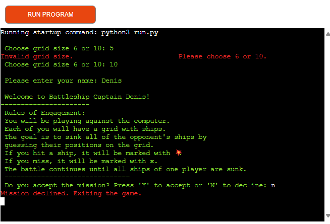
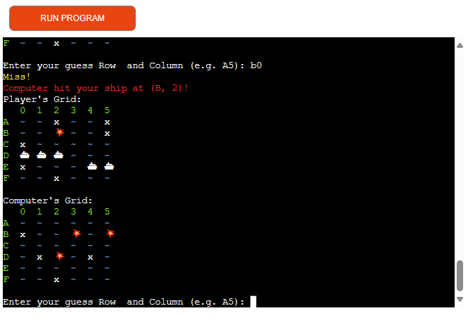
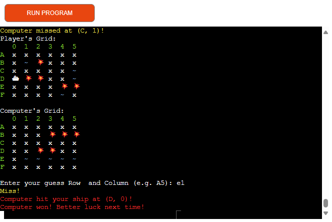
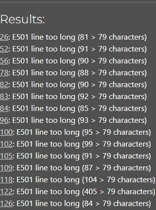

# Battleship
## Overview
This is third projects developed as part of the Code Institute's curriculum.

Project displays the application of Python programming skills and is deployed on Heroku,

demonstrating practical knowledge in web development and cloud deployment.

## About Website
This is a simple implementation of the classic Battleship game in Python. Players take turns guessing the location of their opponent’s ships on a grid. More information can be found here - [Battleship (Game)](https://en.wikipedia.org/wiki/Battleship_(game))

### Deployed website can be found here and runs in the mock terminal on Heroku. - [BattleShip](https://battleship-game-pp3-cci-7084bd9f71a7.herokuapp.com/)

# Index
1. [Overview](#overview)
2. [About](#about-website)
3. [UX](#ux)
  1.  [User stories](#user-stories)
  2.  [Workflow](#workflow)
4. [Deployment](#deployment)
5. [Features](#features)
6. [Testing](#testing)
   1. [Testing User Stories](#testing-user-stories)
   2. [Manual Testing](#manual-testing)
   3. [Validator Testing](#validator-testing)
   4. [Bugs](#bugs)
7. [Languages and Programs](#languages-and-programs)
8. [Credits](#credits)   
9. [Acknowledgements](#acknowledgements)

# UX
## User Stories
* As a user, I want to easily find and understand the rules of the game.
  * So that I can quickly learn how to play and enjoy the game without confusion.
* As a user, I want to be able to enter my name when starting the game.
  * So that the game can personalize my experience and address me by name during gameplay.
* As a user, I want to be able to select the grid size before starting the game.
  * So that I can customize the complexity and duration of my gameplay experience.
* As a user, I want to be presented with the an option to accept or decline game.
  * So that I can make an informed decision to either proceed with the game or exit if I’m not comfortable with the rules.
* As a user, I want the game to automatically place my ships randomly on the grid.
  * So that I don’t have to manually position them and can start playing quickly.
* I want to see the positions of my ships on the grid during gameplay.
  * So that I can strategize and plan my attacks effectively.
* As a user, I want to be able to select a cell on the grid to make my move.
  * So that I can target my opponent’s ships.
* As a user, I want immediate feedback on whether my shot hit or missed an opponent’s ship.
  * So that I can adjust my strategy accordingly.
* As a user, I want to receive a warning or error message if Im fired of grid or alredy fired in this cell.
   * So that I can avoid making incorrect moves.
* As a user, I want to be able to see the locations where my opponent has fired shots on my grid.
  * So that I can strategize and anticipate their next moves.
* As a user, I want to be clearly notified when the game is over.
   * So that I can understand who won and how many turns it took to finish the game.

# Workflow
## Pseudocode
Before starting to write code, I began with pseudocode. Pseudocode is an essential step in algorithm design, aiding the programmer in strategizing a solution and assisting the reader in grasping the method of tackling the problem.

1. Import the necessary libraries (random and time).
2. Define ANSI escape codes for color formatting in the terminal.
3. Define a class called Battleship.
4. In the class constructor (__init__ method):
   - Ask the user to choose a grid size (6 or 10).
   - Initialize player and computer grids based on the chosen size.
   - Initialize sets to store player and computer ship positions and attempts.
   - Define ship sizes based on the chosen grid size.
5. Define a method to print the current state of the player's and computer's grids.
6. Define a method to print a grid with optional hiding of ships.
7. Define a method to place ships randomly on a grid.
8. Define a method to handle player's guess:
   - Ask the player for a guess.
   - Check if the guess is valid and hasn't been attempted before.
   - If the guess hits a ship, mark it and remove the ship position from the set.
   - If the guess misses, mark it on the grid.
9. Define a method to handle computer's guess:
   - Generate a random guess.
   - Check if the guess hasn't been attempted before.
   - If the guess hits a ship, mark it and remove the ship position from the set.
   - If the guess misses, mark it on the grid.
10. Define the main gameplay loop (play method):
    - Ask the player for their name.
    - Print a welcome message and the rules of the game.
    - Ask the player if they accept the mission.
    - If the player declines, exit the game.
    - If the player accepts, place ships on the player's and computer's grids.
    - While there are still ships on both grids, let the player and computer take turns guessing.
    - After each turn, check if all ships of one player have been sunk.
    - If all ships of one player have been sunk, end the game and declare the other player as the winner.
11. Outside the class, create an instance of the Battleship class and start the game by calling the play method.

## Chart

# Deployment
Deployment Steps After Setting Up Your Account:
1. In the top-right corner of your Heroku Dashboard, click New, then choose Create new app from the dropdown.
2. Enter a unique name for your app, select a region closest to you (either EU or USA), and click Create App.
3. In your app’s Settings, select Reveal Config Vars. Set PORT as the KEY and 8000 as the value, then click Add.
4. Scroll down to the Buildpacks section and click Add Buildpack to manage dependencies.
5. Ensure the buildpacks are in the correct order: Python first, followed by Node.js.
6. Navigate to deploy ssection select deployment method.
7. Navigate to deploy branch shoose a branch to deploy.
8. Select deploy branch.
9. After deploymed done select open app to view deployd project.
10. More information can be found here - [HEROKU](https://devcenter.heroku.com/articles/git)
11. Cloning a repository more information can be found here [Cloning a GitHub repository](https://docs.github.com/en/repositories/creating-and-managing-repositories/cloning-a-repository)

# Features
Game runs in a mockup terminal:
Terminal Grid Game Features:

1. Grid Size Selection:
  1. The game starts by prompting the user to choose a grid size: either 6 or 10.
  2. If an incorrect option is selected, the user is asked to choose again until a valid size is provided.
2. Player Name Input:
  1. After selecting the grid size, the user is presented with an option to enter their name or leave it blank.
  2. If the user provides a name, a welcome message with the chosen name is printed to the terminal.
3. Game Rules Display:
  1. Following the welcome message, the game displays the rules of play.
  2. These rules explain how the game works, the objective.
4. Accept or Decline Game:
  1. The user is then presented with the option to accept or decline the game.
     - They can enter:
     1. “Y” to accept and start playing.
     2. “N” to decline the game or any other key to exit the game.
      - Game Decline Message:
      1. If the user declines the game, a message is displayed indicating that the game has been declined. The game then exits.

1. Grid Initialization:
  * The terminal displays the grid size chosen by the user, either 6x6 or 10x10.
  * A predetermined number of ships are randomly placed on the grid, with the quantity depending on the grid size.
2. User Turns:
  * The user makes their move by selecting a cell using row and column coordinates.
  * After the move, a message is displayed in the terminal indicating whether it was a hit or a miss.
  * The chosen location is clearly marked on the grid to track the user’s moves.
3. Boundary Warning:
  * If the user attempts to select a cell outside the grid, a warning message is printed to the terminal advising them to choose a valid location within the grid.
4. Computer’s Turn:
  * The computer’s move is automatically generated and printed in the terminal.
  * The terminal shows the location where the computer has fired, allowing the user to see the computer’s attempts.
5. Gameplay Mechanics:
  * The game continues in turns until all ships are hit or one player has no remaining ships.
  * The grid updates after each turn to reflect the current state of play.
  * Strategic thinking and a bit of luck are key to outmaneuvering the opponent and securing victory.

1. End of Game:
  * Once all ship destroyed message printed to terminal who won, if user won it tells how many turns it took to win.

# Testing
## Testing User Stories
* As a user, I want to easily find and understand the rules of the game.
  * The rules are clearly displayed in terminal.
* As a user, I want to be able to enter my name when starting the game.
  * The game displays a clear input field where user can type his name.
* As a user, I want to be able to select the grid size before starting the game.
  * The game presents user with a selection of grid sizes to choose from.
* As a user, I want to be presented with the an option to accept or decline game.
  * The game clearly displays the rules before the start of the game.
  * There is an “Accept” option to start the game, indicating user agree with the rules.
  * There is a “Decline” option that allows user to exit the game if user do not agree with the rules.
* As a user, I want the game to automatically place my ships randomly on the grid.
  * When starting a new game, the ships  are distributed randomly across the grid.
* I want to see the positions of my ships on the grid during gameplay.
  * The grid displays user ship locations during the game.
  * The ship positions remain visible throughout the game.
* As a user, I want to be able to select a cell on the grid to make my move.
  * The game provides a clear interface where user can enter his choice to make my move.
  * After selecting a cell, the game processes user move and proceeds to the opponent’s turn.
* As a user, I want immediate feedback on whether my shot hit or missed an opponent’s ship.
  * If user shot hits an opponent’s ship, the game displays a visual indicator on the grid.
  * If user shot misses, the game displays a different visual indicator on the grid.
  * The game informs user of the result (hit or miss) after each move.
* As a user, I want to receive a warning or error message if Im fired of grid or alredy fired in this cell.
   * If user attempt to fire at an already targeted cell, the game warns user that it’s an invalid move.
   * If user select a cell outside the grid boundaries, the game provides a clear error message.
   * The game prevents user from proceeding until he make a valid move.
* As a user, I want to be able to see the locations where my opponent has fired shots on my grid.
  * The game displays the opponent’s shots (hits and misses) on user grid.
  * Hits are marked with a visual indicator.
  * Misses are marked with a different visual indicator.
  * The opponent’s shot history remains visible throughout the game.
* As a user, I want to be clearly notified when the game is over.
   * The game displays a distinct message or screen indicating the game has ended.
   * The end-of-game message states which player won.
   * The message includes the total number of turns taken by each player during the game.
## Manual Testing
Test | Steps | Expected Outcome | Result
--- | --- | --- | ---
Initialization | Run the script | The script should prompt you to choose a grid size of 6 or 10 | Yes
Grid Size Input | Enter a valid grid size (6 or 10) | The script should accept the input and proceed to the next step | Yes
---- | Enter an invalid grid size (any number other than 6 or 10) | The script should display an error message and prompt you to enter a valid grid size again | Yes
Player Name Input | Enter a valid name | The script should accept the input and display a welcome message | Yes
---- | No name entered | The script should accept the input and display a welcome message with no name | Yes
Game Rules Acceptance | Enter 'Y' to accept the missionEnter | The script should proceed to the game | Yes
---- | Enter 'N' or any key to decline the mission | The script should display a message "Mission declined. Exiting the game." and exit the game | Yes
Grid prints | No input required | The scrip should display selected grid with amount ships based on it size | Yes
Player Guess | Enter a valid guess (e.g., A5) | The script should accept the input and display whether it was a hit or miss | Yes
---- | Enter an invalid guess (e.g., Z20) | The script should display an error message and prompt you to enter a valid guess again | Yes
Computer Guess | No input required | The script should display the computer's guess and whether it was a hit or miss | Yes
Game End | No input required | The script should display a message indicating who won the game and amout trys it took | Yes

## Validator Testing
No errors. One warnings regarding line too long, were returned when passing through the the [CI Python Linter Validator](https://pep8ci.herokuapp.com/). Warning fixed by breking lines.

## Bugs
* While testing the game, I noticed that if a player selected an incorrect grid size, the error message wasn’t printing in the terminal. I fixed this issue by adding a try and except block.
* While setting up the ships on the grid, I encountered issues due to misspelled variables like shipp or ship where ships should have been used. I resolved this by correcting the spelling mistakes.
* No other known bugs detected.

# Languages and Programs
* Python used to write script [Python](https://www.python.org/doc/)
* Python Tutor used for debugger [Visual Debugger](https://pythontutor.com/)
* Replit used to test and write parts of script [Replit](https://replit.com/login?source=home&goto=%2F%7E)

# Credits
* [W3Schools](https://www.w3schools.com/), [PEP 8 Style Guide]( https://peps.python.org/pep-0008/) were consulted on a regular basis to understand the code being implement and write more readble code.
* Youtube video from [Video](https://www.youtube.com/watch?v=alJH_c9t4zw) was used as refernce for game logic.

# Acknowledgements
* Code Institute and its amazing Slack community for their support and providing me with the necessary knowledge to complete this project.
* My tutor, Marcel, for his invaluable feedback and guidance.
 
[Back To Top](#battleship)

